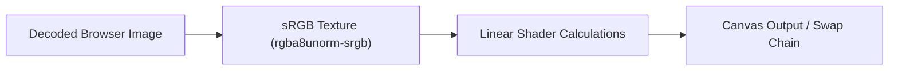

# WebMMD Coordinate System and Winding Conventions

To maintain rendering correctness and pipeline predictability, WebMMD defines a single canonical coordinate system and triangle winding convention.

## Conventions

- **Coordinate System Handedness:** Left-handed (LHS)
  - **X-axis:** Points right (+X is right)
  - **Y-axis:** Points up (+Y is up)
  - **Z-axis:** Points forward (+Z is forward / into the screen)
- **Normal Handedness:** Left-handed, matching positions.
- **Bone Positions:** Left-handed world space.
- **Morph Offsets:** Left-handed translation offsets.
- **Rigid-Body Positions:** Left-handed world space.
- **Triangle Winding:** Clockwise (`"cw"`)
  - Triangle indices in PMX files are defined in clockwise order.
- **Camera Direction:**
  - View space is right-handed (OpenGL default look-at convention), but projection maps it to left-handed clip space.
- **Outline Winding:**
  - Same as the main pipeline (`"cw"`).
  - Outline uses front-face culling to only show the back-facing geometry of the inverted hull mesh.

## Render Pipeline Settings

All render pipelines (opaque, cutout, transparent, outline) must explicitly set:

```typescript
primitive: {
  topology: "triangle-list",
  frontFace: "cw",
  cullMode: cullMode // "back" for main passes, "front" for outline passes, "none" for double-sided
}
```

## Color Space Pipeline

To maintain correct color representation and avoid washed-out or dark-tinted colors, WebMMD uses a linear rendering pipeline:



1. **Decoded Browser Image:** Textures loaded from PNG/JPG/TGA are decoded by the browser.
2. **sRGB Texture (`rgba8unorm-srgb`):** Color-data textures (base texture, sphere maps, toon ramps) are loaded into the GPU using the sRGB texture format. WebGPU automatically converts sRGB color values to linear space upon sampling in the shader.
3. **Linear Shader Calculations:** All lighting, sphere map accumulation, and color math are performed in linear space inside the fragment shader (`fs_main`).
4. **Canvas Output:** The final calculated fragment color is written to the canvas format color attachment, where WebGPU automatically performs sRGB gamma correction for display on the monitor.
